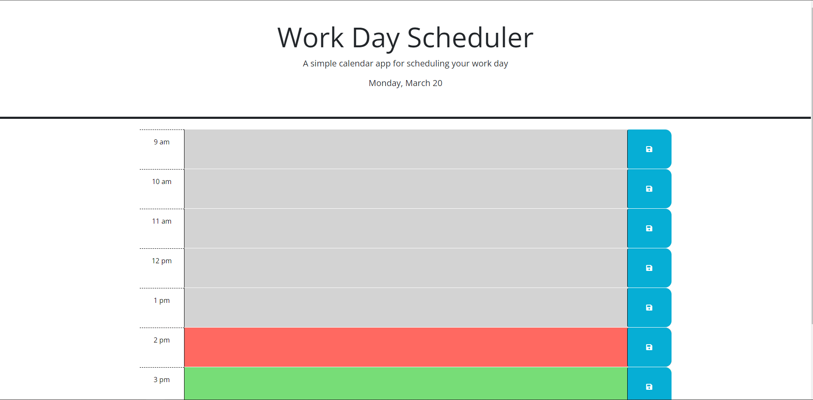

# Homework 5 Schedule

https://seafoodude.github.io/homework-5-schedule/

## Description

This Homework 5 Schedule was created for boot camp students who were going through Module 05. It contains a workday schedule that the user can input and save events as reminders. It also tells the past, current, and future time frames.

My motivation came from my desire to learn about web APIs and apply it in creating a workday schedule.
I created this workday schedule to show that I have learned and absorbed the information given to me through the Module 05 requirement from the UCLA coding bootcamp.
This helped me to achieve a foothold in adding more complex and functional web API programs in my future projects.
I learned how to install a web API and build a workday schedule.

## Table of Contents 

- [Installation](#installation)
- [Usage](#usage)
- [Credits](#credits)
- [License](#license)

## Installation

N/A

## Usage

To use this Homework 5 workday schedule, you can click on any of the time-frames associated with the hour, and save it to local storage as a reminder. For suggestions on what to do first, feel free to save any events into the schedule. The grey hour frames indicate the past time; the red hour frame indicates the current time; and the green hour frames indicate future time. It also tells the day, month, and year.

**SCREENSHOTS**

## Credits

N/A

## License

Please refer to the LICENSE in the repo.